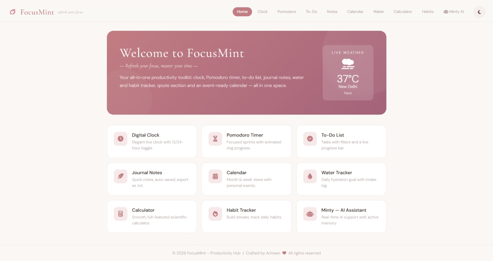

# 🌿 FocusMint — Productivity Hub

> _Refresh your focus, master your time._

FocusMint is an all-in-one, browser-based productivity app with a clean minimal design. It bundles everything you need to stay focused — timers, tasks, habits, notes, calendar, and an AI assistant — all in a single page, no login required.

---

## ✨ Features

| Module                   | What it does                                                             |
| ------------------------ | ------------------------------------------------------------------------ |
| 🕐 **Digital Clock**     | Live clock with 12/24h toggle and seconds on/off                         |
| ⏱ **Pomodoro Timer**     | Animated SVG ring, custom work/break durations, session counter          |
| ✅ **To-Do List**        | Add tasks with priority, filter (All / Active / Done), live progress bar |
| 📓 **Journal Notes**     | Quick-capture notes, auto-saved to `localStorage`, export as `.txt`      |
| 📅 **Calendar**          | Month & week views, add/delete personal events, persisted locally        |
| 💧 **Water Tracker**     | Set daily hydration goal, log intake, visual fill progress               |
| 🔢 **Calculator**        | Full-featured calculator with expression display                         |
| 🔥 **Habit Tracker**     | Daily habits with 7-day dot history and streak awareness                 |
| 🌤 **Live Weather**      | Geolocation-based weather widget on the home screen                      |
| 🤖 **Minty AI**          | Conversational AI assistant powered by GPT-4o-mini (via GitHub Models)   |
| 🌙 **Dark / Light Mode** | Theme toggle, preference saved across sessions                           |

---

## 🏗 Project Structure

```
focusmint/
├── index.html          # Single-page frontend (all sections)
├── styles.css          # Full design system + dark mode
├── script.js           # All frontend logic (vanilla JS, modular IIFEs)
├── logo.png            # App icon (add your own)
│
└── backend/
    ├── main.py         # FastAPI app + LangGraph chatbot
    ├── requirements.txt
    ├── .env            # (gitignored)
    └── .env.example    # Template showing required env vars
```

---

## 🚀 Getting Started

### Frontend (no setup needed)

Just open `index.html` in any browser. All features except Minty AI work instantly — data is stored in your browser's `localStorage`.

## 🔑 Environment Variables

Create a `.env` file inside the `backend/` folder (copy from `.env.example`):

```env
GITHUB_TOKEN=your_github_personal_access_token_here
```

---

## 🧠 How the AI Works

```
Browser → POST /chat → FastAPI → LangGraph → GitHub Models (GPT-4o-mini)
                                                       ↓
Browser ← JSON reply ←─────────────────────── AI Response
```

- **LangGraph** manages the conversation graph and message state.
- **LangChain OpenAI** adapter connects to GitHub's OpenAI-compatible inference endpoint.
- Sessions are stored **in memory** on the server — a server restart clears chat history (by design for a local dev setup).

---

## 🛠 Tech Stack

**Frontend**

- Vanilla HTML5, CSS3, JavaScript (ES6+)
- Font Awesome 6 icons
- Google Fonts (Cormorant Garamond + DM Sans)
- `localStorage` for offline data persistence

**Backend**

- [FastAPI](https://fastapi.tiangolo.com/) — async Python web framework
- [LangChain](https://python.langchain.com/) + [LangGraph](https://langchain-ai.github.io/langgraph/) — AI orchestration
- [GitHub Models](https://github.com/marketplace/models) — free GPT-4o-mini inference
- Uvicorn — ASGI server

---

## 📸 Preview



---

> ⚠️ The free Render tier spins down after inactivity — the first AI response
> after a gap may take ~30 seconds to wake up. Subsequent messages are instant.

---

## 👩‍💻 Author

**Armeen** — built with &nbsp;<i class="fas fa-heart"></i>&nbsp; as a personal productivity project.  
Feel free to fork, use, and improve!

---

## 📄 License

MIT License — free to use and modify.
